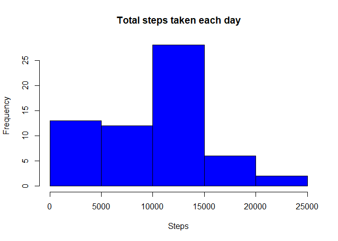
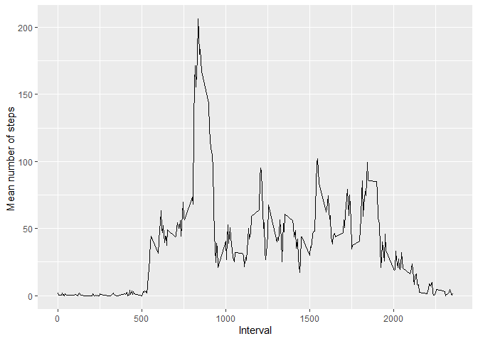
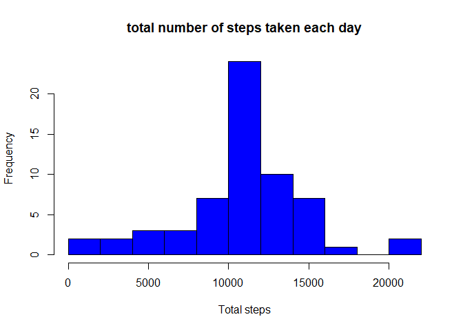
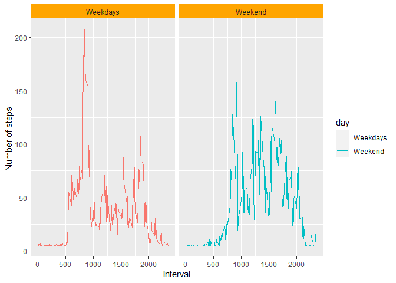

#R Markdown project by Ben

##Introduction

It is now possible to collect a large amount of data about personal movement using activity monitoring devices such as a Fitbit, Nike Fuelband, or Jawbone Up. These type of devices are part of the “quantified self” movement – a group of enthusiasts who take measurements about themselves regularly to improve their health, to find patterns in their behavior, or because they are tech geeks. But these data remain under-utilized both because the raw data are hard to obtain and there is a lack of statistical methods and software for processing and interpreting the data.

This assignment makes use of data from a personal activity monitoring device. This device collects data at 5 minute intervals through out the day. The data consists of two months of data from an anonymous individual collected during the months of October and November, 2012 and include the number of steps taken in 5 minute intervals each day.

The data for this assignment can be downloaded from the course web site:

Dataset: Activity monitoring data [52K]
The variables included in this dataset are:

steps: Number of steps taking in a 5-minute interval (missing values are coded as \color{red}{\verb|NA|}NA)
date: The date on which the measurement was taken in YYYY-MM-DD format
interval: Identifier for the 5-minute interval in which measurement was taken
The dataset is stored in a comma-separated-value (CSV) file and there are a total of 17,568 observations in this dataset.

The first bit of analysis I will perform it to look at the relationship between number of steps taken and the days in our study


```r
library(dplyr)
```

```
## 
## Attaching package: 'dplyr'
```

```
## The following objects are masked from 'package:stats':
## 
##     filter, lag
```

```
## The following objects are masked from 'package:base':
## 
##     intersect, setdiff, setequal, union
```

```r
library(ggplot2)
library(timeDate)


data1<-read.csv(file="activity.csv",head=TRUE,sep=",")
data1$date<-as.Date(data1$date,format="%Y-%m-%d")
head(data1)
```

```
##   steps       date interval
## 1    NA 2012-10-01        0
## 2    NA 2012-10-01        5
## 3    NA 2012-10-01       10
## 4    NA 2012-10-01       15
## 5    NA 2012-10-01       20
## 6    NA 2012-10-01       25
```

1. Calculate the total number of steps taken per day


```r
DailyStep<-data1 %>% group_by(date) %>%summarise(total=sum(steps,na.rm=TRUE))
DailyStep
```

```
## # A tibble: 61 x 2
##    date       total
##    <date>     <int>
##  1 2012-10-01     0
##  2 2012-10-02   126
##  3 2012-10-03 11352
##  4 2012-10-04 12116
##  5 2012-10-05 13294
##  6 2012-10-06 15420
##  7 2012-10-07 11015
##  8 2012-10-08     0
##  9 2012-10-09 12811
## 10 2012-10-10  9900
## # ... with 51 more rows
```

2. Make a histogram of the total number of steps taken each day

```r
hist(DailyStep$total,col="blue",main = "Total steps taken each day",xlab="Steps")
```

<!-- -->

3. Calculate and report the mean and median of the total number of steps taken per day

```r
data1 %>%select(steps, date) %>% group_by(date) %>%summarise(total=sum(steps,na.rm=TRUE),mean=mean(steps,na.rm=TRUE),median=median(steps,na.rm=TRUE))
```

```
## # A tibble: 61 x 4
##    date       total    mean median
##    <date>     <int>   <dbl>  <dbl>
##  1 2012-10-01     0 NaN         NA
##  2 2012-10-02   126   0.438      0
##  3 2012-10-03 11352  39.4        0
##  4 2012-10-04 12116  42.1        0
##  5 2012-10-05 13294  46.2        0
##  6 2012-10-06 15420  53.5        0
##  7 2012-10-07 11015  38.2        0
##  8 2012-10-08     0 NaN         NA
##  9 2012-10-09 12811  44.5        0
## 10 2012-10-10  9900  34.4        0
## # ... with 51 more rows
```

## What is the average daily activity pattern?

In the next section we will look at the intervals and the daily activity pattern

1. Make a time series plot of the 5-minute interval and the average number of steps taken, averaged across all days


```r
IntStep<-data1 %>% select(steps,interval)%>%group_by(interval) %>%summarise(mean=mean(steps,na.rm=TRUE))

ggplot(IntStep,aes(x = interval, y = mean)) + geom_line()+ xlab("Interval")+ ylab("Mean number of steps ")
```

<!-- -->

2. Which 5-minute interval, on average across all the days in the dataset, contains the maximum number of steps?


```r
data1 %>% select(steps,interval)%>%group_by(interval) %>%summarise(mean=mean(steps,na.rm=TRUE))%>%arrange(desc(mean))%>%head(1)
```

```
## # A tibble: 1 x 2
##   interval  mean
##      <int> <dbl>
## 1      835  206.
```

The maximum average steps taken interval is 835 to 840 minutes interval, which taken the 206 steps in that interval.

## Imputing missing values

This section will deal with missing values

1.count missing values


```r
sum(is.na(data1))
```

```
## [1] 2304
```

2. Devise a strategy for filling in all of the missing values in the dataset

the stratergy I have chosen is to input missing values with the mean from that day


```r
datafill<-data1
for(i in 1:ncol(datafill)){
  datafill[is.na(datafill[,i]), i] <- mean(datafill[,i], na.rm = TRUE)
}
```


3.Update the dataset


```r
head(datafill)
```

```
##     steps       date interval
## 1 37.3826 2012-10-01        0
## 2 37.3826 2012-10-01        5
## 3 37.3826 2012-10-01       10
## 4 37.3826 2012-10-01       15
## 5 37.3826 2012-10-01       20
## 6 37.3826 2012-10-01       25
```

4.Make a histogram of the total number of steps taken each day and Calculate and report the mean and median total number of steps taken per day.


```r
datafill1<-datafill %>%select(steps, date) %>% group_by(date) %>%summarise(total=sum(steps,na.rm=TRUE))
hist(datafill1$total,10, col="blue",main="total number of steps taken each day", xlab="Total steps")
```

<!-- -->


```r
datafill %>%select(steps, date) %>% group_by(date) %>%summarise(total=sum(steps,na.rm=TRUE),mean=mean(steps,na.rm=TRUE),median=median(steps,na.rm=TRUE))
```

```
## # A tibble: 61 x 4
##    date        total   mean median
##    <date>      <dbl>  <dbl>  <dbl>
##  1 2012-10-01 10766. 37.4     37.4
##  2 2012-10-02   126   0.438    0  
##  3 2012-10-03 11352  39.4      0  
##  4 2012-10-04 12116  42.1      0  
##  5 2012-10-05 13294  46.2      0  
##  6 2012-10-06 15420  53.5      0  
##  7 2012-10-07 11015  38.2      0  
##  8 2012-10-08 10766. 37.4     37.4
##  9 2012-10-09 12811  44.5      0  
## 10 2012-10-10  9900  34.4      0  
## # ... with 51 more rows
```

These new values differ from the ones in section 1, because we now have more data that is all skewed towards the same point.


## Are there differences in activity patterns between weekdays and weekends?
In this section we will look at how weekend and weekday activity differs

1.Create a new variable in the dataset


```r
datafill$date <- as.Date(datafill$date)
datafill$day<-ifelse(isWeekday(datafill$date, wday=1:5), "Weekdays", "Weekend")

head(datafill)
```

```
##     steps       date interval      day
## 1 37.3826 2012-10-01        0 Weekdays
## 2 37.3826 2012-10-01        5 Weekdays
## 3 37.3826 2012-10-01       10 Weekdays
## 4 37.3826 2012-10-01       15 Weekdays
## 5 37.3826 2012-10-01       20 Weekdays
## 6 37.3826 2012-10-01       25 Weekdays
```

2.Make a panel plot containing a time series plot of the 5-minute interval and the average number of steps taken, averaged across all weekday days or weekend days 


```r
weekplot<-datafill %>% select(steps,interval,day)%>%group_by(day, interval) %>%summarise(mean=mean(steps,na.rm=TRUE))

ggplot(weekplot,aes(x = interval, y = mean,colour=day)) + geom_line(aes(colour=day))+ xlab("Interval")+ ylab("Number of steps ")+facet_wrap(~day)+theme(strip.background = element_rect(fill="orange"))
```

<!-- -->


